# CalendarView

Simple calendar view framework for iOS, written in Swift.

<p align="center">
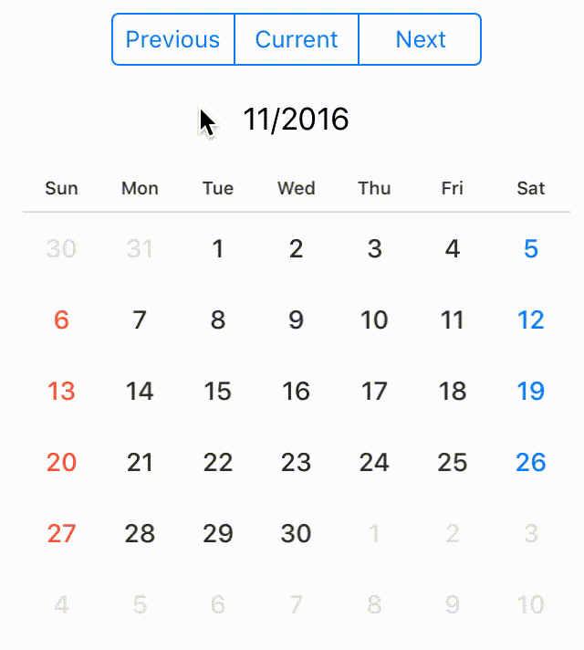
</p>

## Content

- [Features](#features)
- [Requirements](#requirements)
- [Installation](#installation)
- [Demo App](#demo_app)
- [Usage](#usage)
    - **Introduction**
        - [Change displayed month](#change-displayed-month)
        - [Hide days of other months](#hide-days-of-other-months)
        - [Get current month string](#get-current-month-string)
        - [The selection state of date](#the-selection-state-of-date)
        - [Highlight specific days](#highlight-specific-days)
    - **Delegate**
        - [CalendarViewDelegate](#calendar_view_delegate)
    - **Customize CalendarView**
        - [Customize layout properties](#customize-layout-properties)
        - [Customize text postion](#customize-text-postion)
        - [Customize text font](#customize-text-font)
        - [Customize weeks text](#customize-weeks-text)
        - [Customize color properties](#customize-color-properties)
- [License](#license)

## <a name="features"> Features


[](http://mit-license.org)

- Simple Calendar View
- Customizable in any properties for appearance
- Selectable calender
- Support `@IBDesignable` and `@IBInspectable`
- Compatible with ***Carthage***
- Support ***Swift 5.0***

## <a name="requirements"> Requirements

- iOS 13.0+
- Xcode 12.0+
- Swift 5.0+

## <a name="installation"> Installation

### CocoaPods

**TODO: Move to separate repo**

CalendarView is available through [CocoaPods](http://cocoapods.org). 
To install it, simply add the following line to your `Podfile`:

```
pod "CalendarView"
```

## <a name="demo_app"> Demo App

**TODO: Add example**

Open `Example/CalendarView.xcworkspace` and run `CalendarView-Example` to see a simple demonstration.

## <a name="usage"> Usage

***CalendarView*** is designed to be easy to use

```swift
let frame = CGRect(x: 10, y : 20, width: 250, height: 300)
let calendarView = CalendarView(frame: frame, sectionSpace: 1.5, cellSpace: 0.5, inset: .zero, weekCellHeight: 25, dateNow: Date())
view.addSubview(calendarView)
```

`CalendarView` is available in Interface Builder.
Set custom class of `UICollectionView ` to `CalendarView`

```swift
@IBOutlet weak var calendarView: CalendarView!
```

### <a name="change-displayed-month"> Change displayed month

If you want to change displayed month, call `display(in: MonthType)`. `MonthType` is defined by three types.

```swift
public enum MonthType { case previous, current, next }
    
// change month
calendarView.display(in: .next)
```

### <a name="hide-days-of-other-months"> Hide days of other months

If you want to hide days of other months, set `isHiddenOtherMonth` to `true`. 
Days of other months aren't displayed and user can't select.

```swift
calendarView.isHiddenOtherMonth = true
```

### <a name="get-current-month-string"> Get current month string

```swift  
let currentDateString = calendarView.currentDateString()
```

> NOTE

> If you want to change `dateFormat` of `currentDateString`, set argument to format. `currentDateString(withFormat: "MM/yyyy")`

> default `dateFormat` of `currentDateString` is `M/yyyy`

### <a name="the-selection-state-of-date"> The selection state of date

You can configure ***SelectionMode*** with style.

***SelectionMode*** has nested enumerations type: `SequenceStyle`, `Style`.

```swift
public enum SelectionMode {
    case single(style: Style), multiple(style: Style), sequence(style: SequenceStyle), none
    
    public enum SequenceStyle { case background, circle, semicircleEdge, line }
    public enum Style { case background, circle, line }
}
    
// default selectionMode is single, circle style
public var selectionMode: SelectionMode = .single(style: .circle)
    
// call selectionStyle
calendarView.selectionMode = .single(style: .circle)
```

 **single** |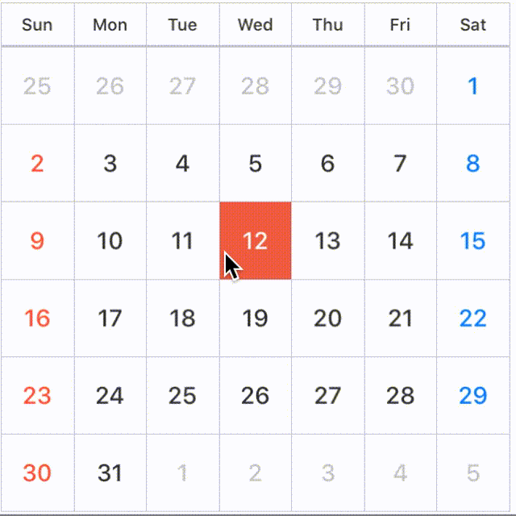 | 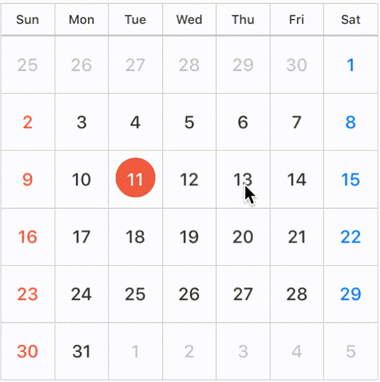 | 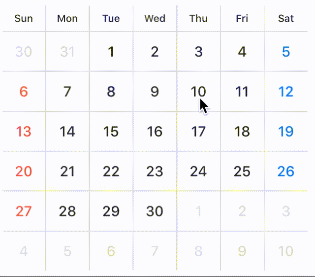
----  |  ----  |  ----  |  ----  |
 ***SelectionMode*** |  `.single(style: .background)`  |   `.single(style: .circle)` | `.single(style: .line)` |
 
 
  **multiple** |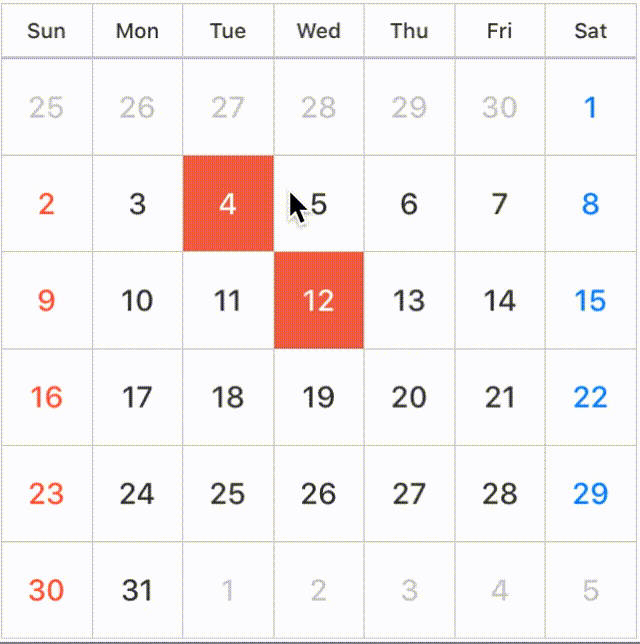 | 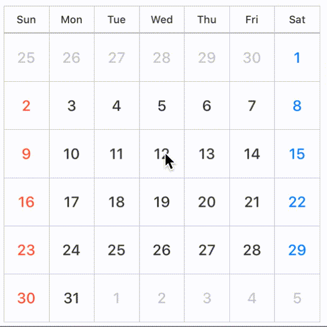 | 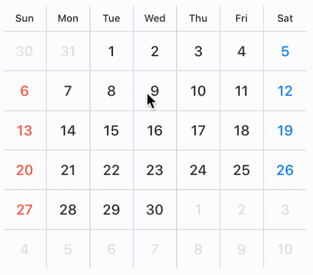
----  |  ----  |  ----  | ----  |
 ***SelectionMode*** |  `.multiple(style: .background)`  |   `.multiple(style: .circle)` | `.multiple(style: .line)` |
 
 
  **sequence** | 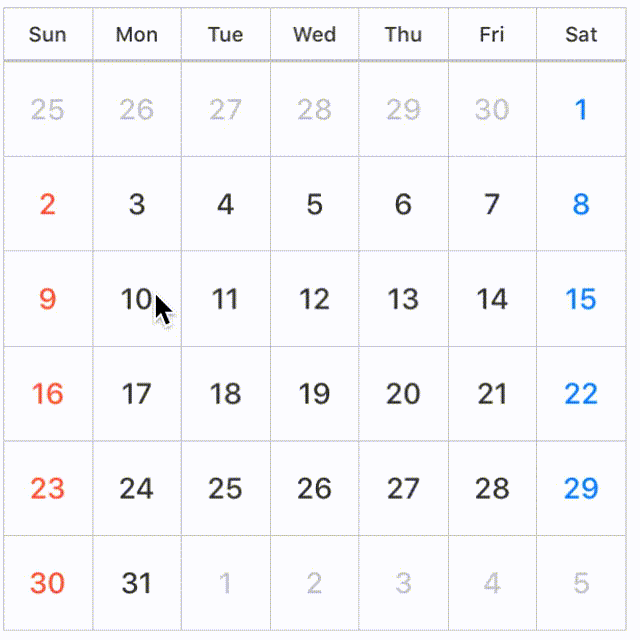 | 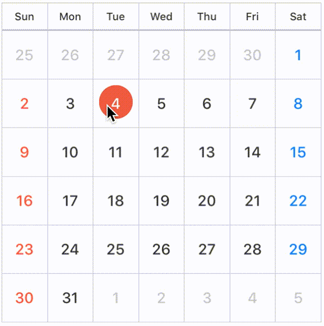 | 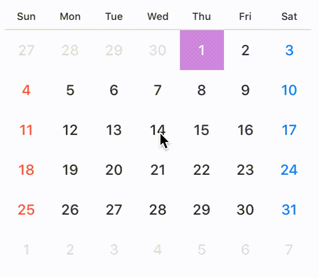　| 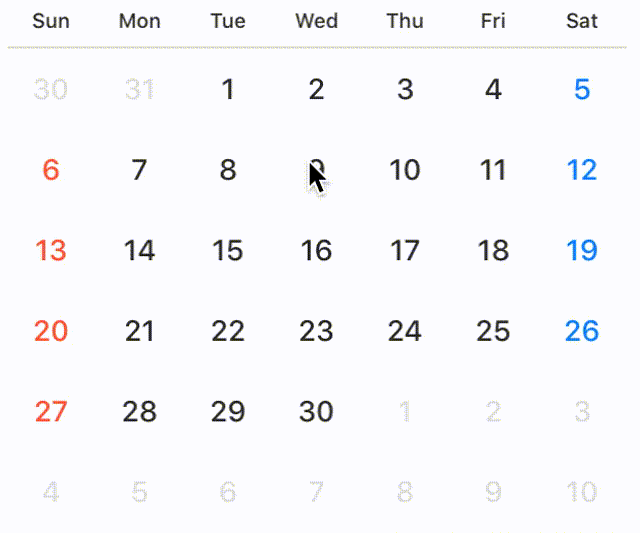
----  |  ----  |  ----  | ----  | ----  |
 ***SelectionMode*** |  `.sequence(style: .background)`  |   `.sequence(style: .circle)` |  `.sequence(style: .semicircleEdge)` | `.sequence(style: .line)` |
 
You can configure lineView in the case of `line` style.

```swift
public struct LineView {
    public enum Position { case top, center, bottom }
    public var height: CGFloat = 1
    public var widthRate: CGFloat = 1 // default is 1.0 (0.0 ~ 1.0)
    public var position: Position = .center
}

calendarView.selectionMode = .single(style: .line)
calendarView.lineView.height = 3
calendarView.lineView.position = .bottom
calendarView.lineView.widthRate = 0.7
```

> NOTE

> If you don't want to allow user to select date by user interaction, set `selectionMode` to `.none`.

#### Select date in programmatically

You can select specific date.
 
```swift
let today = Date()
var components = DateComponents()
components.day = 7
let weekLaterDay = Calendar.current.date(byAdding: components, toDate: today)
calendarView.select(date: today, to: weekLaterDay)
    
// If want to select only one day. 
calendarView.select(date: today)
    
// If want to select multiple day.
let dates: [Date] = [date1, date2, date3]
calendarView.select(dates: dates)
```

You can also unselect available.

```swift
calendarView.unselect(today, to: weekLaterDay) 
// If want to unselect only one day.
calendarView.unselect(today)
// If want to unselect multiple day.
let dates: [Date] = [date1, date2, date3]
calendarView.unselect(dates: dates)
    
// unselect all date
calendarView.unselectAll()
```

You can configure style color and text state in selected state.

```swift
@IBInspectable public var selectedStyleColor: UIColor
    
public enum SelectedTextState { case change(UIColor), keeping }
public var selectedDayTextState: SelectedTextState
```

***selectedDayTextState***

If you want to change day textColor when the user selects day in the `CalendarView`, set `selectedDayTextState` to `SelectedTextState.change(UIColor)`.

Also, if you don't want to change day textColor when the user selects day, set `selectedDayTextState` to `SelectedTextState.keeping`.

```swift
// day text color change white when selected.
calendarView.selectedDayTextState = .change(.white)

// day text color doesn't change when selected.
calendarView.selectedDayTextState = .keeping
```

### <a name="highlight-specific-days"> Highlight specific days

You can change `dayColor` and `dayBackgroundColor` in specific days.

```swift
calendarView
    .setDayColor(.white, of: today, to: weekLaterDay)
    .setDayBackgrondColor(.black, of: today, to: weekLaterDay)
    
    // set day color only one day.
    // .setDayColor(.white, of: today)
    // .setDayBackgrondColor(.black, of: today)
```

## <a name="calendar_view_delegate"> CalendarViewDelegate

If you want to use `CalendarViewDelegate`, set `calendarDelegate` to `target`

```swift
calendarView.calendarDelegate = self
```

### Declaration

#### CalendarView(_: didSelect: forItemAt)

```swift
optional func calendarView(_ calendarView: CalendarView, didSelect date: Date, forItemAt indexPath: IndexPath) 
```

Tells the delegate that the date at the specified index path was selected.
`date`: the date user selected, when tapped cell

#### CalendarView(_: currentDateString:)

```swift
optional func calendarView(_ calendarView: CalendarView, currentDateString dateString: String)
    
// if you want to change string format, use `currentDateFormat`
calendarView.currentDateFormat = "M/yyyy"
```
Tells the delegate that the displayed month is changed.
`currentDateString`: the current month string, when changed month.

#### CalendarView(_: shouldSelectDates: to: withPeriodLength)

```swift
optional func calendarView(_ calendarView: CalendarView, shouldSelectDates date: Date?, to toDate: Date?, withPeriodLength length: Int) -> Bool
    
//　control date user selected.
func calendarView(_ calendarView: CalendarView, shouldSelectDates date: Date?, to toDate: Date?, withPeriodLength length: Int) -> Bool {
    
    if invalidStartDate <= date && invalidEndDate >= toDate {
        print("Your select day is invalid.")
        return false
    }
    
    if length > 90 {
        print("More than 90 days are invalid period.")
        return false
    }
    
    return true
}
```

`CalendarView` calls this method before select days.
***return value***: true if the item should be selected or false if it should not. `to` is always nil if `selectionMode` isn't `sequence`.

#### CalendarView(_: selectionColorForItemAt: date:)

```swift
optional func calendarView(_ calendarView: CalendarView, selectionColorForItemAt indexPath: IndexPath, date: Date) -> UIColor?
    
func calendarView(_ calendarView: CalendarView, selectionColorForItemAt indexPath: IndexPath, date: Date) -> UIColor? {
    return today == date ? UIColor.black : nil
}
```

`CalendarView` calls this method before setting selectionColor for specific date.
***return value***: UIColor instance for a different color then the default one or return nil to use the default color.

#### CalendarView(_: fontForItemAt: date:)

```swift
func calendarView(_ calendarView: CalendarView, fontForItemAt indexPath: IndexPath, date: Date) -> UIFont?
    
func calendarView(_ calendarView: CalendarView, fontForItemAt indexPath: IndexPath, date: Date) -> UIFont? {
    return today == date ? UIFont(name:"FuturaStd-Bold", size:16) : nil
}
```

`CalendarView` calls this method before setting font for specific date.
***return value***: UIFont instance for a different font then the default one or return nil to use the default font.

## Customize ***CalendarView***

### <a name="customize-layout-properties"> Customize layout properties

```swift
// Support @IBInspectable properties
@IBInspectable var sectionSpace: CGFloa
@IBInspectable var cellSpace: CGFloat
@IBInspectable var weekCellHeight: CGFloat
// Public property
public var inset: UIEdgeInsets
```

<p align="center">
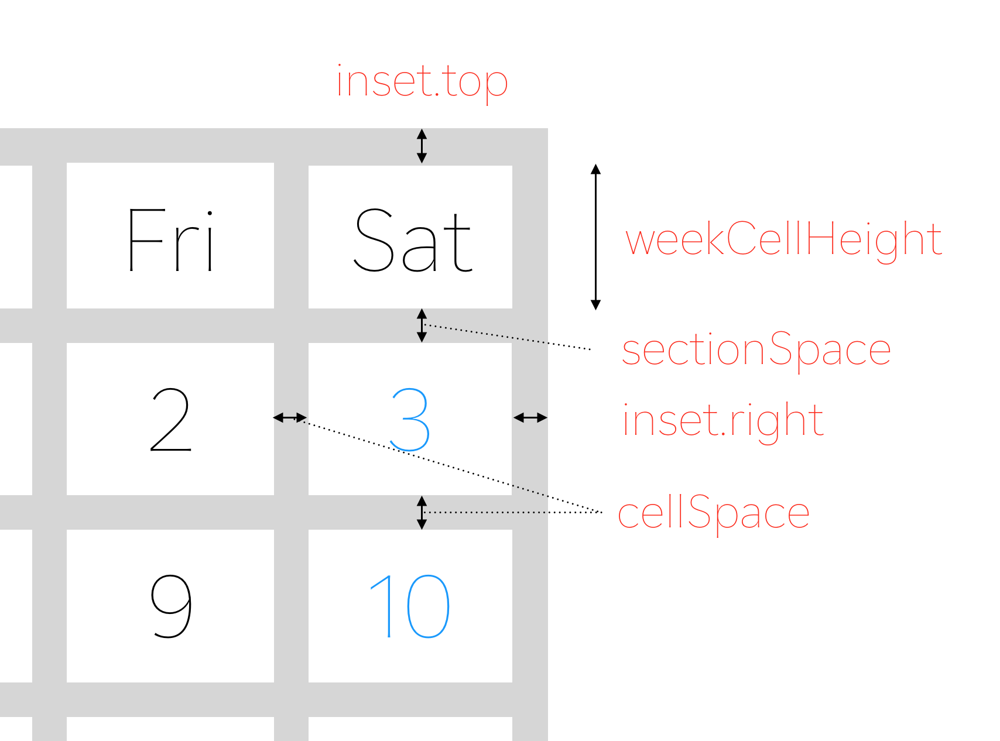
</p>

```swift
calendarView.inset = UIEdgeInsets(top: 0.5, left: 0.5, bottom: 0.5, right: 0.5)
```

Set `sectionSpace`, `cellSpace`, `weekCellHeight` in initialization or Interface Builder.

### <a name="customize-text-postion"> Customize text postion

```swift
public enum ContentPosition {
    case topLeft, topCenter, topRight
    case left, center, right
    case bottomLeft, bottomCenter, bottomRight
    case custom(x: CGFloat, y: CGFloat)
}
```

You can configure text postion.

```swift
// default is .center
calendarView.dayPosition = .topRight
calendarView.weekPosition = .center
    
// custom case
calendarView.dayPosition = .custom(x: 1.2, y: 2.3)
```

### <a name="customize-text-font"> Customize text font

```swift
// set Day and Week Label Font
calendarView
    .setDayFont(size: 12) 
    .setWeekFont(size: 8)
    
// if want to change font name, 
setDayFont(fontName: ".SFUIText-Medium", size: 12)
```

### <a name="customize-weeks-text"> Customize weeks text
 
```swift
calendarView.weeks = ("Sun", "Mon", "Tue", "Wed", "Thu", "Fri", "Sat")
    
// configure with index
calendarView.weeks.0 = "Sun"
calendarView.weeks.1 = "Mon"
calendarView.weeks.2 = "Tue"
...
```

### <a name="customize-color-properties"> Customize color properties

```swift
// Support @IBInspectable properties
@IBInspectable public var sectionSeparatorColor: UIColor
@IBInspectable public var separatorColor: UIColor
@IBInspectable public var weekColor: UIColor
@IBInspectable public var weekdayColor: UIColor
@IBInspectable public var holidayColor: UIColor
@IBInspectable public var otherMonthColor: UIColor
@IBInspectable public var dayBackgrondColor: UIColor
@IBInspectable public var weekBackgrondColor: UIColor
@IBInspectable public var selectedStyleColor: UIColor
```

You can configure the lots of color properties for appearance :weary:

Don't worry, you can easily configure appearance by using `CalendarViewStyle`.

```swift
calendarView.style = .tealBlue
```

<p align="center">
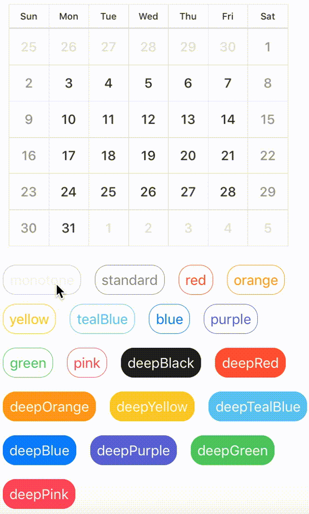
</p>

`CalendarViewStyle` is defined by 19 types + 1 custom.
used [iOS Human Interface Guidelines](https://developer.apple.com/ios/human-interface-guidelines/visual-design/color/) as reference

```swift
enum CalendarViewStyle {
    // basic color style
    case monotone, standard, red, orange, yellow, tealBlue, blue, purple, green, pink
    // deep color style
    case deepBlack, deepRed, deepOrange, deepYellow, deepTealBlue, deepBlue, deepPurple, deepGreen, deepPink
    
    case custom(customColor: CustomColorScheme)
}
```

To use a custom color scheme, you need to define tuple with the necessarry values

```swift
// This is a replica of the `.deepRed` style, you can unleash your creativity here:
let customColorScheme = (dayBackgrond: UIColor.CalendarViewColor.red,
                       weekBackgrond: UIColor.CalendarViewColor.red,
                       week: .white,
                       weekday: .white,
                       holiday: (saturday: UIColor.white, sunday: UIColor.white),
                       otherMonth: UIColor.CalendarViewColor.lightGray,
                       separator: UIColor.CalendarViewColor.orange)
        
calendarView.style = CalendarViewStyle.custom(customColor: customColorScheme)
```

## <a name="license"> License

***CalendarView*** is available under the MIT license.

Based on [Koyomi pod](https://cocoapods.org/pods/Koyomi).